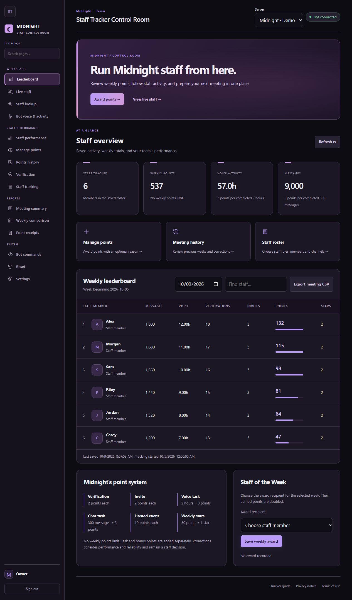
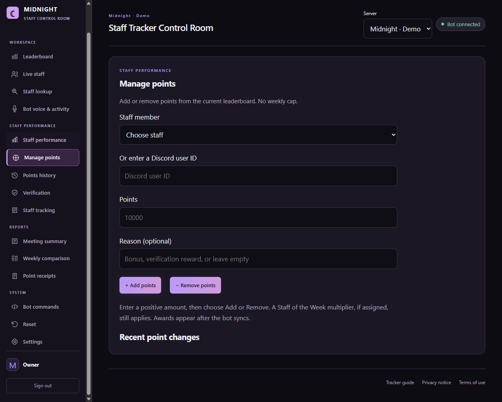
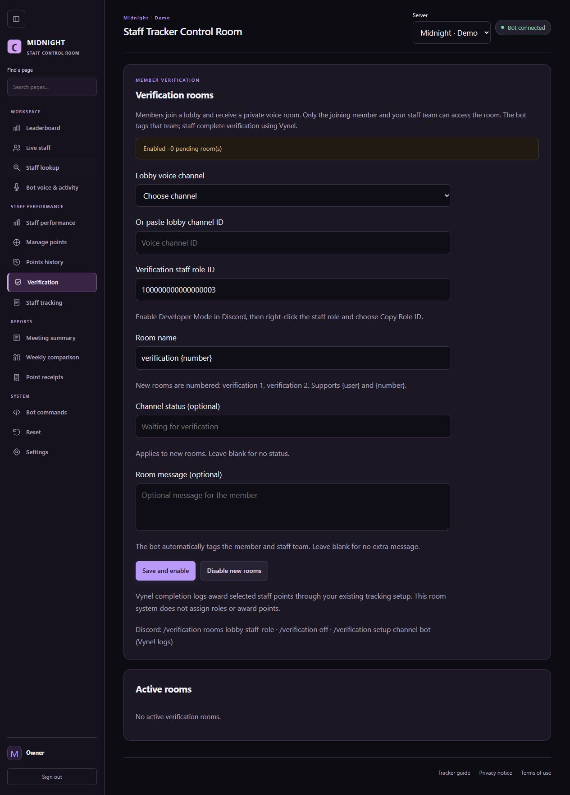

# Midnight Staff Tracker

A Discord staff tracker and private control room, built for **[Midnight Community](https://discord.gg/midnightt)**.

**Created by 082_0** · [GitHub](https://github.com/082-0) · Discord: `082_0`

## Control room

Track the team, award points, review saved activity and configure each server from one dashboard.

## Features

- Ten-place Discord leaderboard with staff profiles and a personal rank button.
- Automatic message and voice tracking, including members who appear offline.
- Point awards and deductions with optional reasons, no default weekly cap, and point receipts.
- Staff lookup with roles, account age, voice channel and saved activity.
- Private verification rooms for the joining member and the configured staff team. Staff complete verification through Vynel; completion logs feed the existing points tracker.
- Weekly comparison, meeting summaries and CSV exports.
- Separate settings and data for each server.
- Slash commands and configurable server text prefixes.

## Manage points

Add or remove points from the dashboard or use `/points add` and `/points remove` in Discord.

## Verification rooms

Configure a lobby channel and staff role by ID. Members receive a private room when they join the lobby. Empty managed rooms are cleaned up automatically.

## About this repository

This is a **showcase**, containing documentation and screenshots only. The bot source, credentials and production records are private. Screenshots use demonstration data.

[Join Midnight Community](https://discord.gg/midnightt)
